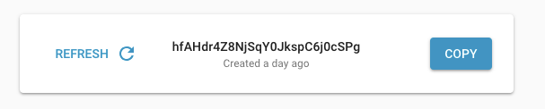

.. _getting-started:

===============
Getting Started
===============

Base URL
========

Unless otherwise noted, all URLs referenced in this documentation have the following base:

    ``https://developers.youversion.com/api/1.0``

Our APIs are served over HTTPS. Unencrypted HTTP connections are not supported.

Authentication
==============

Requests are authenticated by sending along a YouVersion API Developer Token.

That token is sent as a request header ``X-YouVersion-Developer-Token``, the value of which is provided in the YouVersion API Developers Portal.

In addition to that token, our API endpoints expect a couple **required** headers
to be sent along with the request. Currently, those are:

Required Headers
----------------

The following HTTP request headers *must* be present, with a valid value,
for any request to the public API:

.. list-table::
    :header-rows: 1
    :widths: 50 50

    * - Header
      - Description
    * - ``x-youversion-developer-token``
      - **Required**. Your personal API access token, provided in the YouVersion API Developers Portal.
    * - ``accept``
      - **Required**. Presently we'll be responding to public APIs with JSON, so the valid value here is ``application/json``.
    * - ``host``
      - **Required**. Almost always sent automatically by clients, so you likely don't have to provide this explicitly. Usually contains the domain portion of the request URL, e.g. ``developers.youversionapi.com``.
    * - ``user-agent``
      - **Required**. Provided automatically by many clients. This header must have a value for the request to be considered valid. This can be the name of your app or API client.

Here are some examples showing what a valid request might look like for getting the :doc:`Verse Of The Day <api/votd>` for the first day of the year:

.. content-tabs::

    .. tab-container:: curl
        :title: curl

        .. code-block:: text

            curl --request GET \
                --url https://developers.youversionapi.com/1.0/verse_of_the_day/1 \
                --header 'accept: application/json' \
                --header 'referer: https://your-app-url.com/' \
                --header 'x-youversion-developer-token: {your_developer_token}'

    .. tab-container:: js
        :title: javascript

        .. code-block:: javascript

            fetch('https://developers.youversionapi.com/1.0/verse_of_the_day/1', {
            headers: {
                'X-YouVersion-Developer-Token': '{your_developer_token}',
                'Referer': 'https://your-app-url.com/',
                Accept: 'application/json',
            }
            })
            .then((result) => result.json())
            .then((json) => console.log(json))

    .. tab-container:: node
        :title: node

        .. code-block:: javascript

            // TODO

    .. tab-container:: python
        :title: python

        .. code-block:: python

            # TODO

.. _getting-an-api-token:

Getting an API Token
====================

TODO: Walkthrough. Where and how?

Visit the YouVersion API Developers Portal: https://developers.youversion.com

Sign in there with your existing YouVersion account credentials to authorize
the app to supply your account with a developer token.

Once the app is authorized with your YouVersion account you should see an
option to "Get My Token".

After requesting an API token, you should see a new token appear. You can
copy this token for use in making authorized requests to the API.
Something like this:

You can also use the "refresh" option to deactivate your current token, and
have a new one created for you.

Applications built with YouVersion Public APIs
==============================================

None yet! Want yours listed here?

Help Integrating the API
========================

This is currently a YouVersion "Ship-It Week" project, and you're welcome to
ask questions and provide feedback via our Slack channel, `#yv-votd-api`, in
the Open Digerati Slack Team https://opendigerati.slack.com/

You can get an invite to Open Digerati Slack by visiting the home page (https://opendigerati.com/)
and following the "Slack" link in the main menu.
